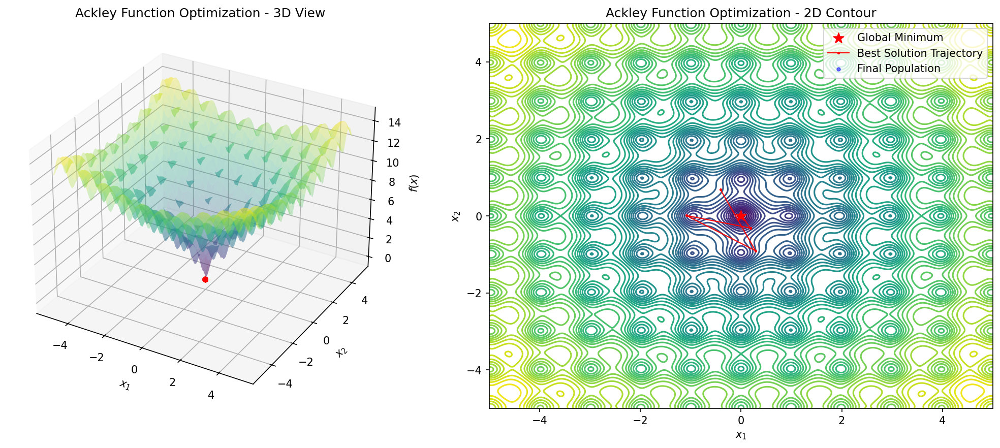

# Differential Evolution

[](https://www.python.org/downloads/)
[](https://opensource.org/licenses/MIT)

A clean, well-documented implementation of the Differential Evolution (DE) optimization algorithm in Python.

## Overview

Differential Evolution is a population-based metaheuristic optimization algorithm that is effective for finding global optima in continuous search spaces. This implementation uses the **DE/rand/1/bin** strategy:

- **rand**: Base vector is randomly selected from the population
- **1**: One difference vector is used for mutation
- **bin**: Binomial crossover

## Features

- Clean, readable implementation with comprehensive docstrings
- Support for n-dimensional optimization problems
- Customizable parameters (population size, mutation factor, crossover rate)
- Built-in visualization tools for 2D problems
- Animation generation for optimization progress
- Multiple benchmark functions included

## Visualization

### Optimization Animation


### Optimization Result



## Installation

This project uses [uv](https://docs.astral.sh/uv/) for dependency management.

```bash
# Clone the repository
git clone <repository-url>
cd differential-evolution

# Create virtual environment and install dependencies
uv sync

# Or install in development mode
uv sync --dev
```

## Quick Start

```python
from differential_evolution import DifferentialEvolution
from funcs import ackley

# Define search bounds for 2D optimization
bounds = [(-5, 5), (-5, 5)]

# Create optimizer
de = DifferentialEvolution(
    bounds=bounds,
    population_size=50,
    mutation_factor=0.8,
    crossover_rate=0.7,
    seed=42,
)

# Run optimization
best_solution, best_fitness = de.optimize(
    objective_func=ackley,
    max_iterations=200,
    verbose=True,
)

print(f"Best solution: {best_solution}")
print(f"Best fitness: {best_fitness}")
```

## Running the Example

```bash
uv run python main.py
```

This will:
1. Optimize the Ackley function using DE
2. Generate a visualization (`optimization_result.png`)
3. Create an animation of the optimization process (`optimization_animation.gif`)
4. Run benchmarks on multiple test functions

## Algorithm

### Mutation (DE/rand/1)

For each target vector `x_i`, a mutant vector `v_i` is created:

```
v_i = x_r1 + F * (x_r2 - x_r3)
```

Where:
- `r1`, `r2`, `r3` are distinct random indices (≠ i)
- `F` is the mutation factor (typically 0.5 to 1.0)

### Binomial Crossover

A trial vector `u_i` is created by mixing the target and mutant vectors:

```
u_ij = v_ij  if rand() < CR or j == j_rand
u_ij = x_ij  otherwise
```

Where:
- `CR` is the crossover rate
- `j_rand` ensures at least one component comes from the mutant

### Selection

Greedy selection keeps the better solution:

```
x_i = u_i  if f(u_i) <= f(x_i)
x_i = x_i  otherwise
```

## Benchmark Functions

The following benchmark functions are included:

| Function | Global Minimum | Search Domain |
|----------|----------------|---------------|
| Sphere | f(0,...,0) = 0 | [-5.12, 5.12]^n |
| Ackley | f(0,...,0) ≈ 0 | [-5, 5]^n |
| Rastrigin | f(0,...,0) = 0 | [-5.12, 5.12]^n |
| Rosenbrock | f(1,...,1) = 0 | [-5, 10]^n |
| Griewank | f(0,...,0) = 0 | [-600, 600]^n |

## API Reference

### DifferentialEvolution

```python
class DifferentialEvolution:
    def __init__(
        self,
        bounds: List[Tuple[float, float]],
        population_size: int = 50,
        mutation_factor: float = 0.8,
        crossover_rate: float = 0.7,
        seed: Optional[int] = None,
    ) -> None: ...

    def optimize(
        self,
        objective_func: Callable[[np.ndarray], float],
        max_iterations: int = 1000,
        tolerance: float = 1e-8,
        verbose: bool = False,
    ) -> Tuple[np.ndarray, float]: ...

    def get_history(self) -> List[np.ndarray]: ...
```

## Project Structure

```
differential-evolution/
├── differential_evolution.py  # Core DE algorithm
├── funcs.py                   # Benchmark functions
├── visualization.py           # Plotting utilities
├── main.py                    # Example usage
├── pyproject.toml             # Project configuration
└── README.md                  # This file
```

## References

- Storn, R., & Price, K. (1997). Differential Evolution – A Simple and Efficient Heuristic for Global Optimization over Continuous Spaces. *Journal of Global Optimization*, 11(4), 341-359.
- Das, S., & Suganthan, P. N. (2011). Differential Evolution: A Survey of the State-of-the-Art. *IEEE Transactions on Evolutionary Computation*, 15(1), 4-31.

## License

MIT License
